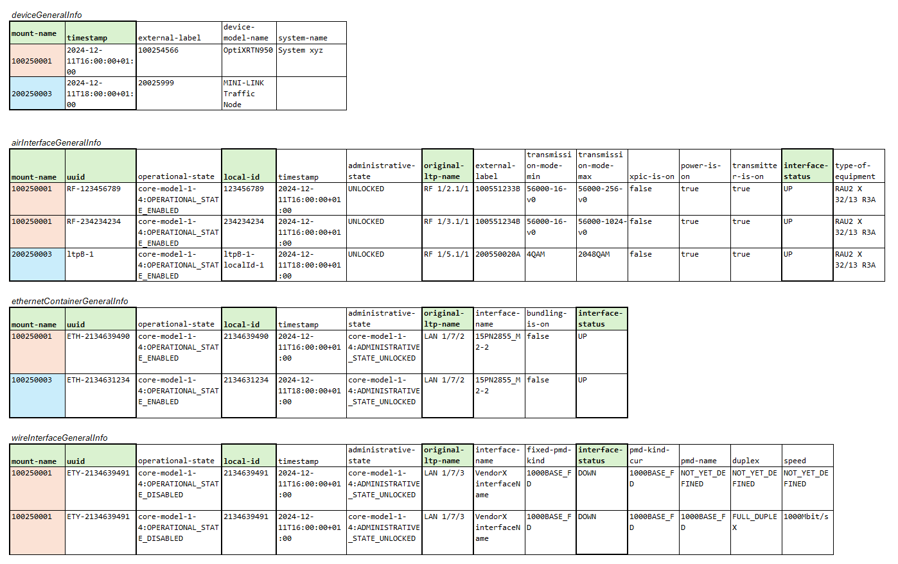

# Interface info for devices in NEP cache

This document describes how the interface information per device shall be mapped from cached data into the required output formats.  

### General information
- The data will shall provided in csv format, with a header line
  - therefore, data will be flattened
- The service will return data for all devices, not just for a single device
- Note that the NEP does not keep all interfaces in its cache:
  - MAC interface information is retrieved on demand from MacAddressTableRecorder
  - from the retrieved and filtered ControlConstruct data is only kept for air-interface, ethernet-container and wire-interface 

### Mappings

#### 1. Device interface information

Related service: */v1/provide-list-of-interfaces-per-device-in-nep*  

The following data for all devices should be gathered into the following columns:

- from *generalDeviceInfo*  (1) (see description of ):
  - `mount-name`
  - `timestamp`: the timestamp from when the data was gathered by the cyclic process and written to NEP cache.
- from *airInterfaceGeneralInfo/ethernetContainerGeneralInfo/wireInterfaceGeneralInfo*:
  - `uuid`: this is the *logical-termination-point/uuid*
  - `local-id`: this is the *logical-termination-point/layer-protocol/uuid*
  - `original-ltp-name`: this is the valued from *ltp-augment-1-0:ltp-augment-pac/original-ltp-name*
  - `interface-type`: this indicates which of the following types the interface has, i.e. it's an enum:
    - 'air-interface',
    - 'ethernet-container',
    - 'wire-interface'
  - `interface-status`: this indicates the status the interface was in, when data was retrieved last, i.e. UP, DOWN, etc.

Note:  
- for (1) see description of service [*/v1/provide-general-information-of-devices*](./_GeneralDeviceInfoMappings.md)
- for (2) see descriptions of services
  - [/v1/provide-air-interface-general-information-of-devices](./_AirInterfaceMappings.md)
  - [/v1/provide-ethernet-container-general-information-of-devices](./_EthernetContainerMappings.md)
  - [/v1/provide-wire-interface-general-information-of-devices](./_WireInterfaceMappings.md)
- in case of missing information the respective field in the data output is to be left blank
- the data is to be sorted according to mount-name, interface-type, uuid, local-id

---  

As data is not to be taken from the filtered ControlConstruct data, but from the NEP cache, the sample input data shows the data in the output format of the services listed above (as how data is actually organized within the NEP cache is up to the implementer):

Sample data *generalDeviceInfo*:
```
mount-name;timestamp;external-label;device-model-name;system-name
100250001;2024-12-11T16:00:00+01:00;100254566;OptiXRTN950;System xyz
200250003;2024-12-11T18:00:00+01:00;20025999;MINI-LINK Traffic Node;
```

Sample data *airInterfaceGeneralInfo*:
```
mount-name;uuid;operational-state;local-id;timestamp;administrative-state;original-ltp-name;external-label;transmission-mode-min;transmission-mode-max;xpic-is-on;power-is-on;transmitter-is-on;interface-status;type-of-equipment
100250001;RF-123456789;core-model-1-4:OPERATIONAL_STATE_ENABLED;123456789;2024-12-11T16:00:00+01:00;UNLOCKED;RF 1/2.1/1;100551233B;56000-16-v0;56000-256-v0;false;true;true;UP;RAU2 X 32/13 R3A
100250001;RF-234234234;core-model-1-4:OPERATIONAL_STATE_ENABLED;234234234;2024-12-11T16:00:00+01:00;UNLOCKED;RF 1/3.1/1;100551234B;56000-16-v0;56000-1024-v0;false;true;true;UP;RAU2 X 32/13 R3A
200250003;ltpB-1;core-model-1-4:OPERATIONAL_STATE_ENABLED;ltpB-1-localId-1;2024-12-11T18:00:00+01:00;UNLOCKED;RF 1/5.1/1;200550020A;4QAM;2048QAM;false;true;true;UP;RAU2 X 32/13 R3A
```

Sample data *ethernetContainerGeneralInfo*:
```
mount-name;uuid;operational-state;local-id;timestamp;administrative-state;original-ltp-name;interface-name;bundling-is-on;interface-status
100250001;ETH-2134639490;core-model-1-4:OPERATIONAL_STATE_ENABLED;2134639490;2024-12-11T16:00:00+01:00;core-model-1-4:ADMINISTRATIVE_STATE_UNLOCKED;LAN 1/7/2;15PN2855_M2-2;false;UP
100250003;ETH-2134631234;core-model-1-4:OPERATIONAL_STATE_ENABLED;2134631234;2024-12-11T18:00:00+01:00;core-model-1-4:ADMINISTRATIVE_STATE_UNLOCKED;LAN 1/7/2;15PN2855_M2-2;false;UP
```

Sample data *wireInterfaceGeneralInfo*:
```
mount-name;uuid;operational-state;local-id;timestamp;administrative-state;original-ltp-name;interface-name;fixed-pmd-kind;interface-status;pmd-kind-cur;pmd-name;duplex;speed
100250001;ETY-2134639491;core-model-1-4:OPERATIONAL_STATE_DISABLED;2134639491;2024-12-11T16:00:00+01:00;core-model-1-4:ADMINISTRATIVE_STATE_UNLOCKED;LAN 1/7/3;VendorX interfaceName;1000BASE_FD;DOWN;1000BASE_FD;NOT_YET_DEFINED;NOT_YET_DEFINED;NOT_YET_DEFINED;
100250001;ETY-2134639491;core-model-1-4:OPERATIONAL_STATE_DISABLED;2134639491;2024-12-11T16:00:00+01:00;core-model-1-4:ADMINISTRATIVE_STATE_UNLOCKED;LAN 1/7/3;VendorX interfaceName;1000BASE_FD;DOWN;1000BASE_FD;1000BASE_FD;FULL_DUPLEX;1000Mbit/s
```

The picture shows the data with the relevant columns being marked:  


Compiled response data:  
```
mount-name;timestamp;uuid;local-id;original-ltp-name;interface-type;interface-status
100250001;2024-12-11T16:00:00+01:00;RF-123456789;123456789;RF 1/2.1/1;air-interface;UP
100250001;2024-12-11T16:00:00+01:00;RF-234234234;234234234;RF 1/3.1/1;air-interface;UP
100250001;2024-12-11T16:00:00+01:00;ETH-2134639490;2134639490;LAN 1/7/2;ethernet-container;UP
100250001;2024-12-11T16:00:00+01:00;ETY-2134639491;2134639491;LAN 1/7/3;wire-interface;DOWN
100250001;2024-12-11T16:00:00+01:00;ETY-2134639491;2134639491;LAN 1/7/3;wire-interface;DOWN
100250003;2024-12-11T18:00:00+01:00;ETH-2134631234;2134631234;LAN 1/7/2;ethernet-container;UP
200250003;2024-12-11T18:00:00+01:00;ltpB-1;ltpB-1-localId-1;RF 1/5.1/1;air-interface;UP
```


[go up to CyclicDataRetrievalMappings](CyclicDataRetrievalProcess.md)