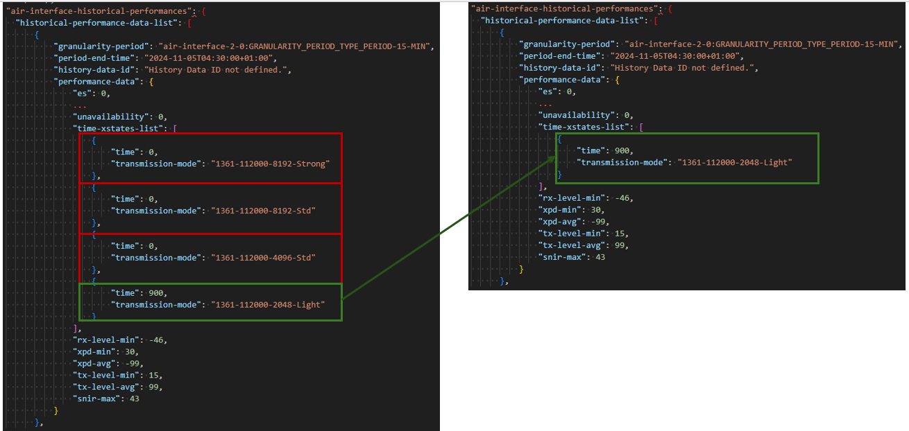

# Cyclic process for updating NEP cache by fetching device data from MWDI

The NetExplorerProxy will maintain an own deviceList and retrieve filtered ControlConstruct data from the MWDI periodically.

### Maintaining the deviceList and caching data  
- The NEP will periodically retrieve the list of all connected devices from the MWDI.
  - if there are new devices in the MWDI deviceList, which are not yet included in the NEP deviceList, those devices will be added to the NEP deviceList
  - devices which are no longer in connected state on the Controller, will also no longer be included in the MWDI deviceList, but those shall be kept in the NEP deviceList for a configurable retention period. This shall minimize data loss in case of devices which are disconnected, but become connected again shortly after.
- For each device in the NEP deviceList, filtered ControlConstruct data is queried from MWDI periodically and written to the NEP cache
  - the data is kept for a configurable amount of time, after that time has passed, old data is deleted
  - note: there is no separate retrieval for 24h data (static device information) and 15min data (historical performance data), as the amount of 24h data is fairly small.

---  

### Data retrieval intervals  
The ControlConstruct data to be retrieved contains historical performances. Some device types only store historical performance data for the last 8 hours. Therefore, the data needs to be fetched from the MWDI before the data is overwritten.  
Therefore, the retrieval for each device should be done periodically, with a configurable interval.
To allow for performance and load balancing optimizations two retrieval interval thresholds will be specified:
- *lower threshold*: if the cached data for the given device is newer than the lower threshold, the device is skipped 
- *upper threshold*: if the cached data for the given device is older than the upper threshold, the device is queried with priority to ensure no data is lost

If there are devices with data older than the upper threshold, they shall be queried with priority. Apart from that the slidingWindow just goes over the devices in a cyclic manner and skips those, for which data is newer than configured in the lower threshold

In case the data retrieval from MWDI fails for a device, retrieval retries shall be applied under consideration of the related retry profileInstances.

#### Consideration of notifications
MWDI offers notifications about device status changes and changes to stored ControlConstruct data.  
However, for this NEP release updates due to notifications are out of scope.  

---  

### Relevant profileInstances

The profileInstances directly relevant to the cyclic data retrieval process are listed below.

- `EmbeddingCausesRequestForDeviceDataFromMwdi`
  - the fields filter is to be applied to the ControlConstruct request to MWDI
- `slidingWindowSize`
- `responseTimeout`
- `maximumNumberOfRetries`
- `waitingTimeBeforeRetry`
- `deviceListSyncPeriod`
- `ccRetrievalMinThresholdTime`
  - the lower threshold (hours)
- `ccRetrievalMaxThresholdTime`
  - the upper threshold (hours)
- `dataRetention`
  - the number of days for which old data shall be kept in NEP cache, before it is deleted
  - it is sufficient to delete on day granularity
- `deviceRetention`
  - the number of days devices which are no longer connected are kept in the NEP deviceList before they are deleted

---  

### Additional filtering off retrieved data
When ControlConstruct data is retrieved from MWDI a fields filter is applied.
As the fields filter can be just applied to properties but not properties values, some unneeded data will be retrieved by that. This data can be deleted from the retrieved data, before it it written to the NEP cache.

#### AirInterface historical performances: time-xstates-list

The time-xstates-list can contain lots of transmission mode entries where the time is 0.  
The list shall be filtered, to only keep those transmission mode records, where time > 0.  

See example:  


#### Ltp blocks
The logical-termination-point list contains lots of ltps, for which no data is to be extracted. Those can be filtered out.
I.e. only keep blocks which are related to one of the following interfaces:
- air-interface 
- ethernet-container
- wire-interface

The following snippet gives an example, all blocks which are not marked as to be kept, can be filtered out.
```
{
  "core-model-1-4:control-construct": {
      "logical-termination-point": [
          {
              "uuid": "LTP-TDMCONTAINER-TTP-4-29",
              "layer-protocol": [
                  {
                      "local-id": "LP-TDMCONTAINER-TTP-4-29"
                  }
              ],
              "ltp-augment-1-0:ltp-augment-pac": {
                  "original-ltp-name": "SL91SP3D/4/29"
              }
          },
          {
              "uuid": "LTP-MACINTERFACE-TTP-6-4",
              "layer-protocol": [
                  {
                      "local-id": "LP-MACINTERFACE-TTP-6-4"
                  }
              ],
              "ltp-augment-1-0:ltp-augment-pac": {
                  "original-ltp-name": "SL91EM6FA/6/4"
              }
          },
          {
              "uuid": "LTP-SSMEXTCLOCK-TTP-0-240-1",
              "layer-protocol": [
                  {
                      "local-id": "LP-SSMEXTCLOCK-TTP-0-240-1"
                  }
              ],
              "ltp-augment-1-0:ltp-augment-pac": {
                  "original-ltp-name": "CSH/0/240/1"
              }
          },
          {
              "uuid": "LTP-PURE-TTP-6-1",
              "layer-protocol": [
                  {
                      "local-id": "LP-PURE-TTP-6-1"
                  }
              ],
              "ltp-augment-1-0:ltp-augment-pac": {
                  "original-ltp-name": "SL91EM6FA/6/1"
              }
          },
          ### keep ###
          {
              "uuid": "LTP-ETHERNETCONTAINER-TTP-6-4",
              "layer-protocol": [
                  {
                      "local-id": "LP-ETHERNETCONTAINER-TTP-6-4",
                      "ethernet-container-2-0:ethernet-container-pac": {
                          "ethernet-container-status": {
                              "interface-status": "ethernet-container-2-0:INTERFACE_STATUS_TYPE_DOWN"
                          }
                      }
                  }
              ],
              "ltp-augment-1-0:ltp-augment-pac": {
                  "original-ltp-name": "SL91EM6FA/6/4"
              }
          },
          {
              "uuid": "LTP-TDMCONTAINER-TTP-4-32",
              "layer-protocol": [
                  {
                      "local-id": "LP-TDMCONTAINER-TTP-4-32"
                  }
              ],
              "ltp-augment-1-0:ltp-augment-pac": {
                  "original-ltp-name": "SL91SP3D/4/32"
              }
          },
          ### keep ###
          {
              "uuid": "LTP-MWPS-TTP-1-1",
              "layer-protocol": [
                  {
                      "local-id": "LP-MWPS-TTP-1-1",
                      "air-interface-2-0:air-interface-pac": {
                          "air-interface-status": {
                              "interface-status": "air-interface-2-0:INTERFACE_STATUS_TYPE_UP"
                          }
                      }
                  }
              ],
              "ltp-augment-1-0:ltp-augment-pac": {
                  "original-ltp-name": "SL91ISX2/1/1"
              }
          },
          ### keep ###
          {
              "uuid": "LTP-WIREINTERFACE-TTP-6-4",
              "layer-protocol": [
                  {
                      "local-id": "LP-WIREINTERFACE-TTP-6-4",
                      "wire-interface-2-0:wire-interface-pac": {
                          "wire-interface-status": {
                              "interface-status": "wire-interface-2-0:INTERFACE_STATUS_TYPE_DOWN"
                          }
                      }
                  }
              ],
              "ltp-augment-1-0:ltp-augment-pac": {
                  "original-ltp-name": "SL91EM6FA/6/4"
              }
          }
      ...
  }
}
```

### Mappings between input data and output services

Notice that data is gathered on device basis, i.e. separately for each device.  
How data will be stored internally in the NEP cache is up to the implementer, but it must be ensured that NEP provides sufficient performance.  

However, the data exposed to Netexplorer, will not be on device basis, but aggregated across devices, and be rather separated by logical data classes. E.g. there will be multiple services to serve different parts of the gathered air interface data for all (desired) devices.  

Detailed mapping descriptions can be found here:  
- air interface: todo
- ethernet container: todo
- wire interface: todo
- equipment: todo
- general-device info: todo