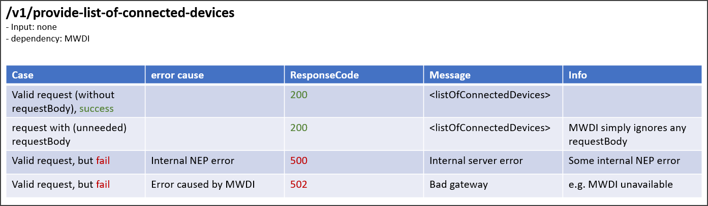
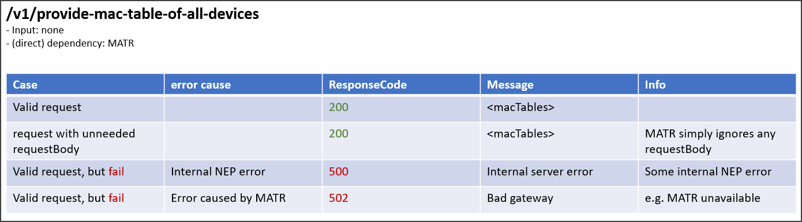
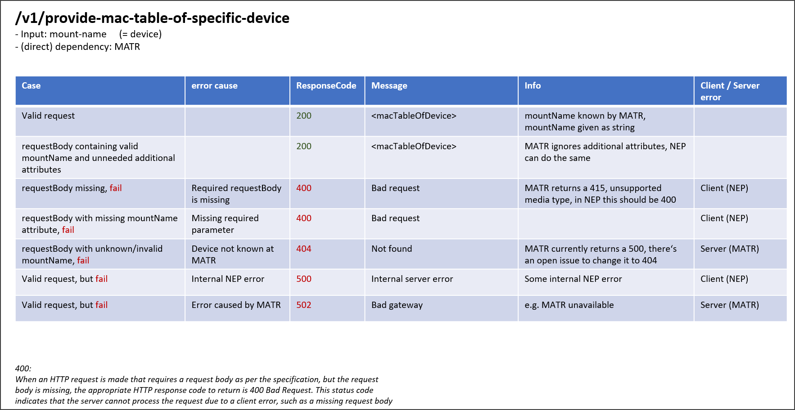
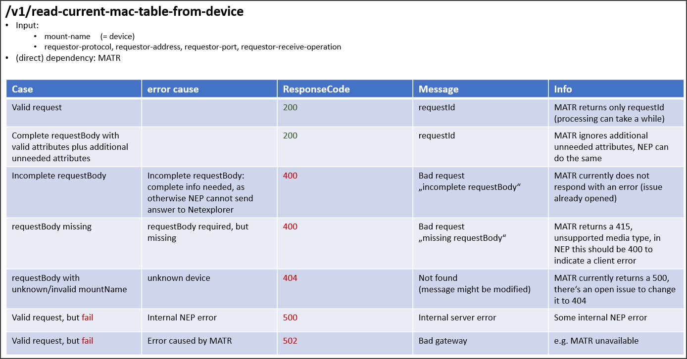
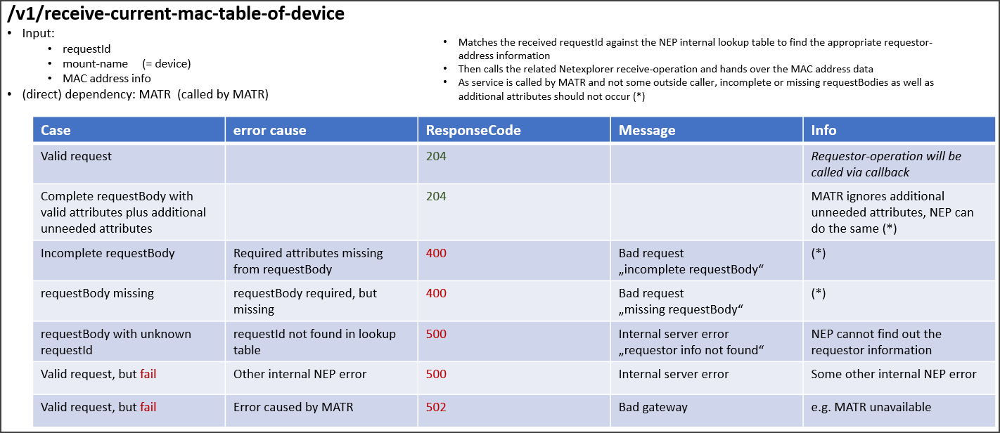

# ResponseCode Overview

This page describes which response codes should be returned when the NEP (NetExplorerProxy) interacts with other 
applications like MWDI (MicroWaveDeviceInventory) and MATR (MacAddressTableRecorder).  

## /v1/provide-list-of-connected-devices  
This service reads the list of connected devices from the MWDI.

  

## /v1/provide-mac-table-of-all-devices  
This service retrieves the MAC table of all devices from the MATR internal cache.
MATR uses information from MWDI, but that usage is capsulated.  
Thus, the only direct dependency is the MATR.  

  

## /v1/provide-mac-table-of-specific-device
This service retrieves the MAC table of a specific device from the MATR internal cache.  
Again MATRs usage of MWDI is capsulated and MATR is the only direct dependency for NEP.  

  

## /v1/read-current-mac-table-from-device  
This service reads the current from a device by calling the related service offered by MATR.  
As the data is not just retrieved from MATRs internal cache, but freshly retrieved from the live network, the retrieval can take a while and MATR only returns a requestId.  
Some immediate errors can occur, as reflected in the table, which lead to no requestId being returned.  
The only direct dependency is the MATR.  

  

## /v1/receive-current-mac-table-of-device
This service is called by MATR when a set of current mac table data for a device has been successfully retrieved.  
If no errors are observed the obtained data is sent back to the requestor (i.e. Netexplorer)
together with the related requestId.
Again, MATR is the only direct dependency.  
  

