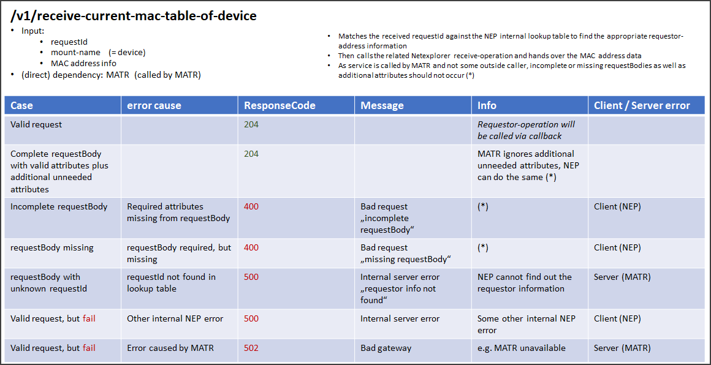

# ResponseCode Overview

This page describes which response codes should be returned when the NEP (NetExplorerProxy) interacts with other 
applications like MWDI (MicroWaveDeviceInventory) and MATR (MacAddressTableRecorder).  

  
  
  
  
  

