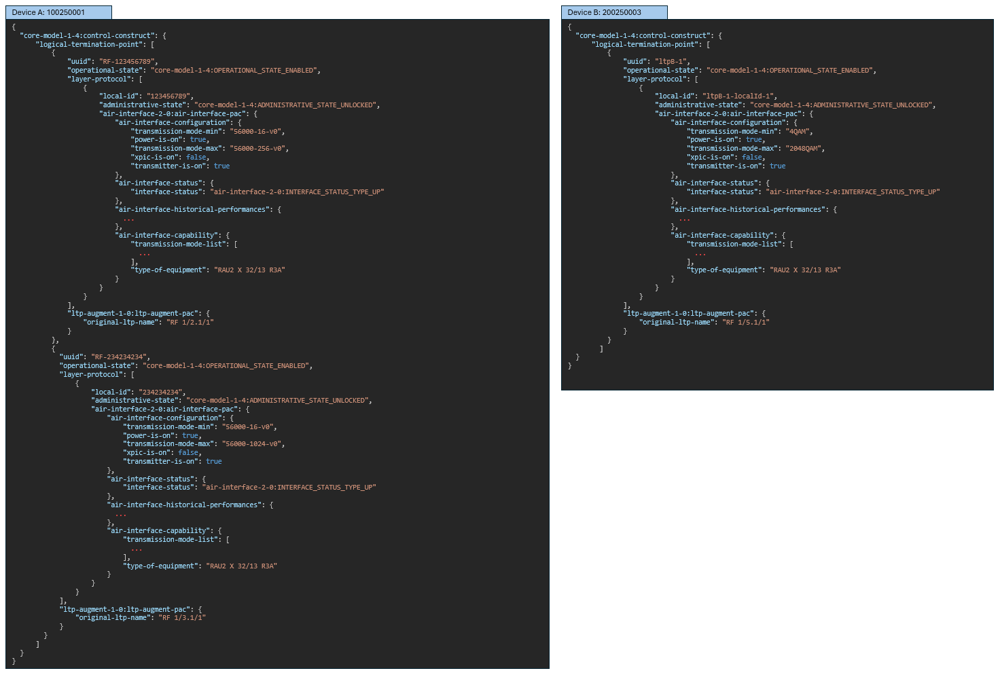

# AirInterface Data Output Mapping

This document describes how the air interface data shall be mapped from cached data into the required output formats.  
Air interface data provisioning to Netexplorer will be split across several services.

### General information
- The data will shall provided in csv format, with a header line
  - therefore, data will be flattened
- Each services will return data for all devices, not just for a single device
  - optional filtering for a list of specific devices, will be supported via a related requestBody parameter

### Mappings
The complete set of sample data will be given a the end of the document; for better understandability, parts of the data are presented here separately.

#### 1. General interface information

Related service: */v1/provide-air-interface-general-information-of-devices*  

The following data for all (target) devices should be gathered into the following columns:
- general information:
  - `mount-name`
  - `uuid`: logical-termination-point/uuid
  - `operational-state`: logical-termination-point/operational-state
  - `local-id`: logical-termination-point/layer-protocol/uuid
  - `timestamp`: the timestamp from when the data was gathered by the cyclic process and written to NEP cache. It just needs to be by a single of the services mentioned in this document.
  - `administrative-state` 
  - `original-ltp-name`: related ltp-augment-1-0:ltp-augment-pac/original-ltp-name
- from air-interface-configuration:
  - `transmission-mode-min`
  - `transmission-mode-max`
  - `xpic-is-on`
  - `power-is-on`
  - `transmitter-is-on`
- from air-interface-status
  - `interface-status`: provide without the substring "air-interface-2-0:INTERFACE_STATUS_TYPE"
- from air-interface-capability:
  - `type-of-equipment`

Excerpt from sample data:  


Compiled response data:  
```
mount-name;uuid;operational-state;local-id;timestamp;administrative-state;original-ltp-name;transmission-mode-min;transmission-mode-max;xpic-is-on;power-is-on;transmitter-is-on;interface-status;type-of-equipment
100250001;RF-123456789;core-model-1-4:OPERATIONAL_STATE_ENABLED;123456789;2024-12-11T16:00:00+01:00;UNLOCKED;RF 1/2.1/1;56000-16-v0;56000-256-v0;false;true;true;UP;RAU2 X 32/13 R3A
100250001;RF-234234234;core-model-1-4:OPERATIONAL_STATE_ENABLED;234234234;2024-12-11T16:00:00+01:00;UNLOCKED;RF 1/3.1/1;56000-16-v0;56000-1024-v0;false;true;true;UP;RAU2 X 32/13 R3A
200250003;ltpB-1;core-model-1-4:OPERATIONAL_STATE_ENABLED;ltpB-1-localId-1;2024-12-11T16:07:00+01:00;UNLOCKED;RF 1/5.1/1;4QAM;2048QAM;false;true;true;UP;RAU2 X 32/13 R3A
```

---

#### 2. Transmission mode information for capacity calculation

Related service: */v1/provide-air-interface-transmission-mode-lists-of-devices*  

The following columns is to be provided in the response:
- general information:
  - `mount-name`
  - `uuid`
  - `local-id`
- from the air-interface-capability/transmission-mode-list
  - `transmission-mode-name`
  - `symbol-rate-reduction-factor`
  - `modulation-schema-name-at-lct`
  - `modulation-scheme`
  - `code-rate`
  - `channel-bandwidth`
  - `xpic-is-avail`

Again data for all air interfaces of the devices from NEP cache shall be aggregated in a single output.  
For each transmission-mode-list record an interface has, a new line in the csv shall be generated.  

See example for 100250001/RF-123456789/123456789:
```
  "transmission-mode-list": [
      {
          "transmission-mode-name": "56000-64-v0",
          "symbol-rate-reduction-factor": 1,
          "modulation-scheme-name-at-lct": "64 QAM",
          "modulation-scheme": 64,
          "code-rate": 97,
          "channel-bandwidth": 56000,
          "xpic-is-avail": true
      },
      {
          "transmission-mode-name": "56000-256-v0",
          "symbol-rate-reduction-factor": 1,
          "modulation-scheme-name-at-lct": "256 QAM",
          "modulation-scheme": 256,
          "code-rate": 95,
          "channel-bandwidth": 56000,
          "xpic-is-avail": true
      },
      {
          "transmission-mode-name": "56000-16-v0",
          "symbol-rate-reduction-factor": 1,
          "modulation-scheme-name-at-lct": "16 QAM",
          "modulation-scheme": 16,
          "code-rate": 97,
          "channel-bandwidth": 56000,
          "xpic-is-avail": true
      }
  ],
```

which translates into the following set of data:
```
mount-name;uuid;local-id;transmission-mode-name;symbol-rate-reduction-factor;modulation-scheme-at-lct;modulation-scheme;code-rate;channel-bandwidth;xpic-is-avail
100250001;RF-123456789;123456789;56000-64-v0;1;64 QAM;64;97;56000;true
100250001;RF-123456789;123456789;56000-256-v0;1;256 QAM;256;95;56000;true
100250001;RF-123456789;123456789;56000-16-v0;1;16 QAM;16;97;56000;true
```

---

#### 3. Non-QAM performance data

Related service: */v1/provide-air-interface-non-qam-pm-data-of-devices*  

As there can be multiple different qam records for each interval, the data to be returned by this service will not include the qam data.

Instead the following columns shall be returned for each device, with an own line per combination of air interface and time interval from the historical pm data list.
- general information:
  - `mount-name`
  - `uuid`
  - `local-id`
  - `period-end-time`: from air-interface-historical-performances/historical-performance-data-list/period-end-time
- from the historical-performance-data-list/performance-data for the given period-end-time
  - `es`
  - `ses`
  - `ut`: unavailability
  - `rx-level-min`
  - `rx-level-max`
  - `rx-level-avg`
  - `tx-level-min`
  - `tx-level-max`
  - `tx-level-avg`
  - `xpd-min`
  - `xpd-max`
  - `xpd-avg`
  - `snir-min`
  - `snir-max`
  - `snir-avg`

See example for 200250003/ltpB-1/ltpB-1-localId-1:
```
"air-interface-historical-performances": {
    "historical-performance-data-list": [
        {
            "granularity-period": "air-interface-2-0:GRANULARITY_PERIOD_TYPE_PERIOD-15-MIN",
            "period-end-time": "2024-12-11T15:30:00+01:00",
            "history-data-id": "History Data ID not defined.",
            "performance-data": {
                "es": 0,
                "xpd-max": -99,
                "tx-level-max": 15,
                "ses": 10,
                "rx-level-max": -40,
                "snir-min": 38,
                "snir-avg": -99,
                "rx-level-avg": -45,
                "unavailability": 90,
                "time-xstates-list": [
                    ...
                ],
                "rx-level-min": -50,
                "xpd-min": -99,
                "xpd-avg": -99,
                "tx-level-min": 8,
                "tx-level-avg": 20,
                "snir-max": 39
            }
        }
    ]
}, ...
```

which translates into:
```
mount-name;uuid;local-id;period-end-time;es;ses;ut;rx-level-min;rx-level-max;rx-level-avg;tx-level-min;tx-level-max;tx-level-avg;xpd-min;xpd-max;xpd-avg;snir-min;snir-max;snir-avg
200250003;ltpB-1;ltpB-1-localId-1;2024-12-11T15:30:00+01:00;0;10;90;-50;-40;-45;8;15;20;-99;-99;-99;38;39;-99
```

---

#### 4. QAM performance data

Related service: */v1/provide-air-interface-qam-pm-data-of-devices*  

The qam data shall be provided with a separate line per device, air-interface, period-end-time and record from the time-xstates-list.

See example for 200250003/ltpB-1/ltpB-1-localId-1:
```
"air-interface-historical-performances": {
    "historical-performance-data-list": [
        {
            "granularity-period": "air-interface-2-0:GRANULARITY_PERIOD_TYPE_PERIOD-15-MIN",
            "period-end-time": "2024-12-11T15:30:00+01:00",
            "history-data-id": "History Data ID not defined.",
            "performance-data": {
                "es": 0,
                ...
                "unavailability": 90,
                "time-xstates-list": [
                    {
                        "time-xstate-sequence-number": 2,
                        "time": 100,
                        "transmission-mode": "4QAM"
                    },
                    {
                        "time-xstate-sequence-number": 1,
                        "time": 700,
                        "transmission-mode": "16QAM"
                    }
                ],
                "rx-level-min": -50,
                ...
                "snir-max": 39
            }
        }
    ]
},
```

Which results in the following output:
```
mount-name;uuid;local-id;period-end-time;time-xstate-sequence-number;time;transmission-mode
200250003;ltpB-1;ltpB-1-localId-1;2024-12-11T15:30:00+01:00;2;100;4QAM
200250003;ltpB-1;ltpB-1-localId-1;2024-12-11T15:30:00+01:00;1;700;16QAM
```

---

### Complete example data
Consider the following (made up from actual data and shortened!) sample data sets from two devices.

Device A: 100250001
```
{
  "core-model-1-4:control-construct": {
      "logical-termination-point": [
          {
              "uuid": "RF-123456789",
              "operational-state": "core-model-1-4:OPERATIONAL_STATE_ENABLED",
              "layer-protocol": [
                  {
                      "local-id": "123456789",
                      "administrative-state": "core-model-1-4:ADMINISTRATIVE_STATE_UNLOCKED",
                      "air-interface-2-0:air-interface-pac": {
                          "air-interface-configuration": {
                              "transmission-mode-min": "56000-16-v0",
                              "power-is-on": true,
                              "transmission-mode-max": "56000-256-v0",
                              "xpic-is-on": false,
                              "transmitter-is-on": true
                          },
                          "air-interface-status": {
                              "interface-status": "air-interface-2-0:INTERFACE_STATUS_TYPE_UP"
                          },
                          "air-interface-historical-performances": {
                              "historical-performance-data-list": [
                                  {
                                      "granularity-period": "air-interface-2-0:GRANULARITY_PERIOD_TYPE_PERIOD-15-MIN",
                                      "period-end-time": "2024-12-11T12:30:00+01:00",
                                      "history-data-id": "History Data ID not defined.",
                                      "performance-data": {
                                          "es": 0,
                                          "xpd-max": -99,
                                          "tx-level-max": 10,
                                          "ses": 0,
                                          "rx-level-max": -46,
                                          "snir-min": 38,
                                          "snir-avg": -99,
                                          "rx-level-avg": 99,
                                          "unavailability": 0,
                                          "time-xstates-list": [
                                              {
                                                  "time-xstate-sequence-number": 5,
                                                  "time": 899,
                                                  "transmission-mode": "56000-256-v0"
                                              },
                                              {
                                                  "time-xstate-sequence-number": 1,
                                                  "time": 1,
                                                  "transmission-mode": "56000-16-v0"
                                              }
                                          ],
                                          "rx-level-min": -48,
                                          "xpd-min": -99,
                                          "xpd-avg": -99,
                                          "tx-level-min": 9,
                                          "tx-level-avg": 99,
                                          "snir-max": 39
                                      }
                                  },
                                  {
                                      "granularity-period": "air-interface-2-0:GRANULARITY_PERIOD_TYPE_PERIOD-15-MIN",
                                      "period-end-time": "2024-12-11T11:30:00+01:00",
                                      "history-data-id": "History Data ID not defined.",
                                      "performance-data": {
                                          "es": 0,
                                          "xpd-max": -99,
                                          "tx-level-max": 10,
                                          "ses": 0,
                                          "rx-level-max": -46,
                                          "snir-min": 38,
                                          "snir-avg": -99,
                                          "rx-level-avg": 99,
                                          "unavailability": 0,
                                          "time-xstates-list": [
                                              {
                                                  "time-xstate-sequence-number": 5,
                                                  "time": 901,
                                                  "transmission-mode": "56000-256-v0"
                                              }
                                          ],
                                          "rx-level-min": -48,
                                          "xpd-min": -99,
                                          "xpd-avg": -99,
                                          "tx-level-min": 8,
                                          "tx-level-avg": 99,
                                          "snir-max": 39
                                      }
                                  }
                              ]
                          },
                          "air-interface-capability": {
                              "transmission-mode-list": [
                                  {
                                      "transmission-mode-name": "56000-64-v0",
                                      "symbol-rate-reduction-factor": 1,
                                      "modulation-scheme-name-at-lct": "64 QAM",
                                      "modulation-scheme": 64,
                                      "code-rate": 97,
                                      "channel-bandwidth": 56000,
                                      "xpic-is-avail": true
                                  },
                                  {
                                      "transmission-mode-name": "56000-256-v0",
                                      "symbol-rate-reduction-factor": 1,
                                      "modulation-scheme-name-at-lct": "256 QAM",
                                      "modulation-scheme": 256,
                                      "code-rate": 95,
                                      "channel-bandwidth": 56000,
                                      "xpic-is-avail": true
                                  },
                                  {
                                      "transmission-mode-name": "56000-16-v0",
                                      "symbol-rate-reduction-factor": 1,
                                      "modulation-scheme-name-at-lct": "16 QAM",
                                      "modulation-scheme": 16,
                                      "code-rate": 97,
                                      "channel-bandwidth": 56000,
                                      "xpic-is-avail": true
                                  }
                              ],
                              "type-of-equipment": "RAU2 X 32/13 R3A"
                          }
                      }
                  }
              ],
              "ltp-augment-1-0:ltp-augment-pac": {
                  "original-ltp-name": "RF 1/2.1/1"
              }
          },
          {
            "uuid": "RF-234234234",
            "operational-state": "core-model-1-4:OPERATIONAL_STATE_ENABLED",
            "layer-protocol": [
                {
                    "local-id": "234234234",
                    "administrative-state": "core-model-1-4:ADMINISTRATIVE_STATE_UNLOCKED",
                    "air-interface-2-0:air-interface-pac": {
                        "air-interface-configuration": {
                            "transmission-mode-min": "56000-16-v0",
                            "power-is-on": true,
                            "transmission-mode-max": "56000-1024-v0",
                            "xpic-is-on": false,
                            "transmitter-is-on": true
                        },
                        "air-interface-status": {
                            "interface-status": "air-interface-2-0:INTERFACE_STATUS_TYPE_UP"
                        },
                        "air-interface-historical-performances": {
                            "historical-performance-data-list": [
                                {
                                    "granularity-period": "air-interface-2-0:GRANULARITY_PERIOD_TYPE_PERIOD-15-MIN",
                                    "period-end-time": "2024-12-11T12:30:00+01:00",
                                    "history-data-id": "History Data ID not defined.",
                                    "performance-data": {
                                        "es": 0,
                                        "xpd-max": -99,
                                        "tx-level-max": 10,
                                        "ses": 0,
                                        "rx-level-max": -46,
                                        "snir-min": 38,
                                        "snir-avg": -99,
                                        "rx-level-avg": 99,
                                        "unavailability": 0,
                                        "time-xstates-list": [
                                            {
                                                "time-xstate-sequence-number": 5,
                                                "time": 300,
                                                "transmission-mode": "56000-128-v0"
                                            },
                                            {
                                                "time-xstate-sequence-number": 1,
                                                "time": 600,
                                                "transmission-mode": "56000-16-v0"
                                            }
                                        ],
                                        "rx-level-min": -48,
                                        "xpd-min": -99,
                                        "xpd-avg": -99,
                                        "tx-level-min": 9,
                                        "tx-level-avg": 99,
                                        "snir-max": 39
                                    }
                                }
                            ]
                        },
                        "air-interface-capability": {
                            "transmission-mode-list": [
                                {
                                    "transmission-mode-name": "56000-128-v0",
                                    "symbol-rate-reduction-factor": 1,
                                    "modulation-scheme-name-at-lct": "64 QAM",
                                    "modulation-scheme": 128,
                                    "code-rate": 97,
                                    "channel-bandwidth": 56000,
                                    "xpic-is-avail": true
                                },
                                {
                                    "transmission-mode-name": "56000-256-v0",
                                    "symbol-rate-reduction-factor": 1,
                                    "modulation-scheme-name-at-lct": "256 QAM",
                                    "modulation-scheme": 256,
                                    "code-rate": 95,
                                    "channel-bandwidth": 56000,
                                    "xpic-is-avail": true
                                },
                                {
                                    "transmission-mode-name": "56000-16-v0",
                                    "symbol-rate-reduction-factor": 1,
                                    "modulation-scheme-name-at-lct": "16 QAM",
                                    "modulation-scheme": 16,
                                    "code-rate": 97,
                                    "channel-bandwidth": 56000,
                                    "xpic-is-avail": true
                                }
                            ],
                            "type-of-equipment": "RAU2 X 32/13 R3A"
                        }
                    }
                }
            ],
            "ltp-augment-1-0:ltp-augment-pac": {
                "original-ltp-name": "RF 1/3.1/1"
            }
        }
      ]
  }
}
```

Device 2: 200250003
```
{
  "core-model-1-4:control-construct": {
      "logical-termination-point": [
          {
              "uuid": "ltpB-1",
              "operational-state": "core-model-1-4:OPERATIONAL_STATE_ENABLED",
              "layer-protocol": [
                  {
                      "local-id": "ltpB-1-localId-1",
                      "administrative-state": "core-model-1-4:ADMINISTRATIVE_STATE_UNLOCKED",
                      "air-interface-2-0:air-interface-pac": {
                          "air-interface-configuration": {
                              "transmission-mode-min": "4QAM",
                              "power-is-on": true,
                              "transmission-mode-max": "2048QAM",
                              "xpic-is-on": false,
                              "transmitter-is-on": true
                          },
                          "air-interface-status": {
                              "interface-status": "air-interface-2-0:INTERFACE_STATUS_TYPE_UP"
                          },
                          "air-interface-historical-performances": {
                              "historical-performance-data-list": [
                                  {
                                      "granularity-period": "air-interface-2-0:GRANULARITY_PERIOD_TYPE_PERIOD-15-MIN",
                                      "period-end-time": "2024-12-11T15:30:00+01:00",
                                      "history-data-id": "History Data ID not defined.",
                                      "performance-data": {
                                          "es": 0,
                                          "xpd-max": -99,
                                          "tx-level-max": 15,
                                          "ses": 10,
                                          "rx-level-max": -40,
                                          "snir-min": 38,
                                          "snir-avg": -99,
                                          "rx-level-avg": -45,
                                          "unavailability": 90,
                                          "time-xstates-list": [
                                              {
                                                  "time-xstate-sequence-number": 2,
                                                  "time": 100,
                                                  "transmission-mode": "4QAM"
                                              },
                                              {
                                                  "time-xstate-sequence-number": 1,
                                                  "time": 700,
                                                  "transmission-mode": "16QAM"
                                              }
                                          ],
                                          "rx-level-min": -50,
                                          "xpd-min": -99,
                                          "xpd-avg": -99,
                                          "tx-level-min": 8,
                                          "tx-level-avg": 20,
                                          "snir-max": 39
                                      }
                                  }
                              ]
                          },
                          "air-interface-capability": {
                              "transmission-mode-list": [
                                  {
                                      "transmission-mode-name": "4QAM",
                                      "symbol-rate-reduction-factor": 1,
                                      "modulation-scheme-name-at-lct": "4 QAM",
                                      "modulation-scheme": 4,
                                      "code-rate": 97,
                                      "channel-bandwidth": 56000,
                                      "xpic-is-avail": true
                                  },
                                  {
                                      "transmission-mode-name": "2048QAM",
                                      "symbol-rate-reduction-factor": 1,
                                      "modulation-scheme-name-at-lct": "2048 QAM",
                                      "modulation-scheme": 2048,
                                      "code-rate": 95,
                                      "channel-bandwidth": 56000,
                                      "xpic-is-avail": true
                                  }
                              ],
                              "type-of-equipment": "RAU2 X 32/13 R3A"
                          }
                      }
                  }
              ],
              "ltp-augment-1-0:ltp-augment-pac": {
                  "original-ltp-name": "RF 1/5.1/1"
              }
          }
        ]
  }
}
```

[go up to CyclicDataRetrievalMappings](./CyclicDataRetrievalMappings.md)