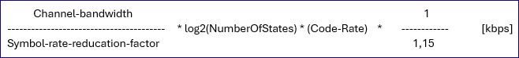

# Air Interface Data Output Mapping

This document describes how the air interface data shall be mapped from cached data into the required output formats.  
Air interface data provisioning to Netexplorer will be split across several services.

### General information
- The data will shall provided in csv format, with a header line
  - therefore, data will be flattened
- Each services will return data for all devices, not just for a single device
  - optional filtering for a list of specific devices, will be supported via a related requestBody parameter

### Mappings

#### 1. General interface information

Related service: */v1/provide-air-interface-general-information-of-devices*  

The following data for all (target) devices should be gathered into the following columns:
- general information:
  - `mount-name`
  - `uuid`: *logical-termination-point/uuid*
  - `operational-state`: *logical-termination-point/operational-state*, provide without the substring "core-model-1-4:OPERATIONAL_STATE_"
  - `local-id`: *logical-termination-point/layer-protocol/uuid*
  - `timestamp`: the timestamp from when the data was gathered by the cyclic process and written to NEP cache. It just needs to be by a single of the services mentioned in this document.
  - `administrative-state`: *logical-termination-point/layer-protocol/administrative-state*, provide without the substring "core-model-1-4:ADMINISTRATIVE_STATE_"
  - `original-ltp-name`: related *ltp-augment-1-0:ltp-augment-pac/original-ltp-name*
  - `external-label`: related *ltp-augment-1-0:ltp-augment-pac/external-label*: contains the unitID, from which the linkId can be derived
- from *air-interface-configuration*:
  - `transmission-mode-min`
  - `transmission-mode-max`
  - `xpic-is-on`
  - `power-is-on`
  - `transmitter-is-on`
- from *air-interface-status*
  - `interface-status`: provide without the substring "air-interface-2-0:INTERFACE_STATUS_TYPE_"
- from *air-interface-capability*:
  - `type-of-equipment`

Excerpt from sample data:  


Compiled response data:  
```
mount-name;uuid;operational-state;local-id;timestamp;administrative-state;original-ltp-name;external-label;transmission-mode-min;transmission-mode-max;xpic-is-on;power-is-on;transmitter-is-on;interface-status;type-of-equipment
100250001;RF-123456789;ENABLED;123456789;2024-12-11T16:00:00+01:00;UNLOCKED;RF 1/2.1/1;100551233B;56000-16-v0;56000-256-v0;false;true;true;UP;RAU2 X 32/13 R3A
100250001;RF-234234234;ENABLED;234234234;2024-12-11T16:00:00+01:00;UNLOCKED;RF 1/3.1/1;100551234B;56000-16-v0;56000-1024-v0;false;true;true;UP;RAU2 X 32/13 R3A
200250003;ltpB-1;ENABLED;ltpB-1-localId-1;2024-12-11T16:07:00+01:00;UNLOCKED;RF 1/5.1/1;200550020A;4QAM;2048QAM;false;true;true;UP;RAU2 X 32/13 R3A
```

---

#### 2. Transmission mode information for capacity calculation

*Note that the transmission mode lists data is required for computing the actual capacity per 15min time interval. However, this computation requires also the provisioning of QAM PM data, which will be provided with a future NEP release.* 

Related service: */v1/provide-air-interface-transmission-mode-lists-of-devices*  

The following columns is to be provided in the response:
- general information:
  - `mount-name`
  - `uuid`
  - `local-id`
- from the *air-interface-capability/transmission-mode-list*
  - `transmission-mode-name`
  - `symbol-rate-reduction-factor`
  - `modulation-schema-name-at-lct`
  - `modulation-scheme`
  - `code-rate`
  - `channel-bandwidth`
  - `xpic-is-avail`
- computed from properties in *air-interface-capability/transmission-mode-list*
  - `capa-factor`: a precomputed factor, see formula below

##### Capa-factor  
The capa-factor is to be computed by the formula used by the TrafficChecker, and to be divided by 1000 to directly get mbps values.  
(Netexplorer then needs to set the capa-factors in relation to the time the links were operating in the respective modulation scheme, once QAM PM data is made available.)

The capacity formula used by TrafficChecker, looks as follows:  


The capa-factor value shall be given with more than one decimal place.

Consider the first record from the example given below ("56000-64-v0"):
```
- channel-bandwidth = 56000
- symbol-rate-reduction-factor = 1
- with NumOfStates = modulation-scheme: log2(NumOfStates) = log2(64) = 6
- code-rate = 97

capa-factor = ((56000 / 1) * log2(64) * 97 * 1/1,15 kbps) / 1000 = 28.340,9 mbps
```

**Example**  
Again data for all air interfaces of the devices from NEP cache shall be aggregated in a single output.  
For each transmission-mode-list record an interface has, a new line in the csv shall be generated.  

See example for 100250001/RF-123456789/123456789:
```
  "transmission-mode-list": [
      {
          "transmission-mode-name": "56000-64-v0",
          "symbol-rate-reduction-factor": 1,
          "modulation-scheme-name-at-lct": "64 QAM",
          "modulation-scheme": 64,
          "code-rate": 97,
          "channel-bandwidth": 56000,
          "xpic-is-avail": true
      },
      {
          "transmission-mode-name": "56000-256-v0",
          "symbol-rate-reduction-factor": 1,
          "modulation-scheme-name-at-lct": "256 QAM",
          "modulation-scheme": 256,
          "code-rate": 95,
          "channel-bandwidth": 56000,
          "xpic-is-avail": true
      },
      {
          "transmission-mode-name": "56000-16-v0",
          "symbol-rate-reduction-factor": 1,
          "modulation-scheme-name-at-lct": "16 QAM",
          "modulation-scheme": 16,
          "code-rate": 97,
          "channel-bandwidth": 56000,
          "xpic-is-avail": true
      }
  ],
```

which translates into the following set of data:
```
mount-name;uuid;local-id;transmission-mode-name;symbol-rate-reduction-factor;modulation-scheme-at-lct;modulation-scheme;code-rate;channel-bandwidth;xpic-is-avail;capa-factor
100250001;RF-123456789;123456789;56000-64-v0;1;64 QAM;64;97;56000;true;28340,9
100250001;RF-123456789;123456789;56000-256-v0;1;256 QAM;256;95;56000;true;37008,7
100250001;RF-123456789;123456789;56000-16-v0;1;16 QAM;16;97;56000;true;18893,9
```

[go up to CyclicDataRetrievalMappings](CyclicDataRetrievalProcess.md)