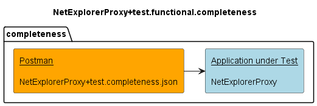
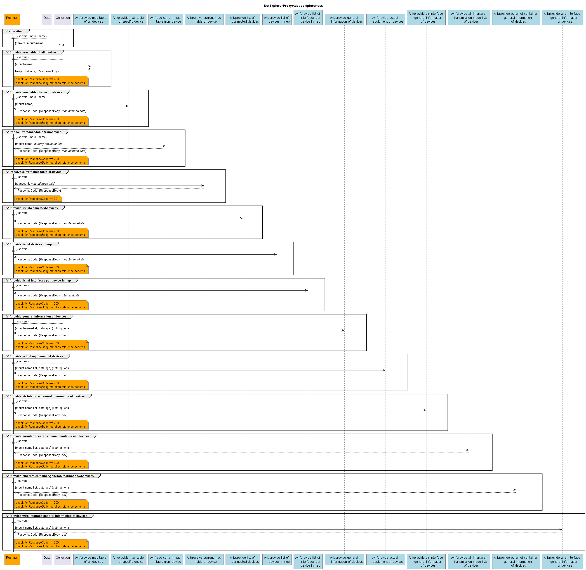

# Testing for Completeness

## Components

## v1.0.0 

## Additional notes
Some of the services shall return their data not with application/json, but with text/csv format.  
Unfortunately there (currently) seems to be an issue with the import into Mockoon, which leads to the  
services being imported with their responseBodies being empty.  
For the respective services the examples need to be added to Mockoon manually after importing the  
simulator.completeness yaml.

The affected services are:
- /v1/provide-general-information-of-devices
- /v1/provide-actual-equipment-information-of-devices
- /v1/provide-air-interface-general-information-of-devices
- /v1/provide-air-interface-transmission-mode-lists-of-devices
- /v1/provide-ethernet-container-general-information-of-devices
- /v1/provide-wire-interface-general-information-of-devices

For easier usage, the respective examples to be copied have also been provided in a separate file:  
[NetExplorerProxy+simu.examples.completeness](./v1.0.0/simulators/NetExplorerProxy+simu.examples.txt)  