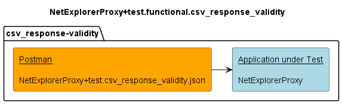

# Testing for CSV Response Validity

## Components

## v1.0.0 

## Additional notes
There are two types of services specified for NetExplorerProxy:
- those returning their data with format application/csv,
- and those with responseBody format txt/csv.

For the first group, the completness checks also compare the responses against reference schemas, which contain all relevant properties of the responses.  
For the txt/csv services, however, the reference schema is just simply a string (which could literally contain anything).  

Therefore this testcase collection aims at providing at least a basic validity check for responses received from those services:
- they shall always return at least the specified header line, even if there is no device data found in the NEP cache
- therefore the first line of the respective response is compared against the expected header line for the tested service
  - validity of the device data itself cannot be done here, as this data is not static. 

The services to be tested are:
- /v1/provide-general-information-of-devices
- /v1/provide-actual-equipment-information-of-devices
- /v1/provide-air-interface-general-information-of-devices
- /v1/provide-air-interface-transmission-mode-lists-of-devices
- /v1/provide-air-interface-non-qam-pm-data-of-devices
- /v1/provide-air-interface-qam-pm-data-of-devices
- /v1/provide-ethernet-container-general-information-of-devices
- /v1/provide-ethernet-container-pm-data-of-devices
- /v1/provide-wire-interface-general-information-of-devices

Notes:
- Note that there is a problem with the import to Mockoon, which requires the data to be returned to be copied manually into the Mockoon response bodies.  
  For easier usage, the respective examples to be copied have also been provided in a separate file:  
  [NetExplorerProxy+simu.examples.csv_response-validity](./v1.0.0/simulators/NetExplorerProxy+simu.examples.txt)  
- If the completness simulator has already been imported to Mockoon, this simulator could be used instead.